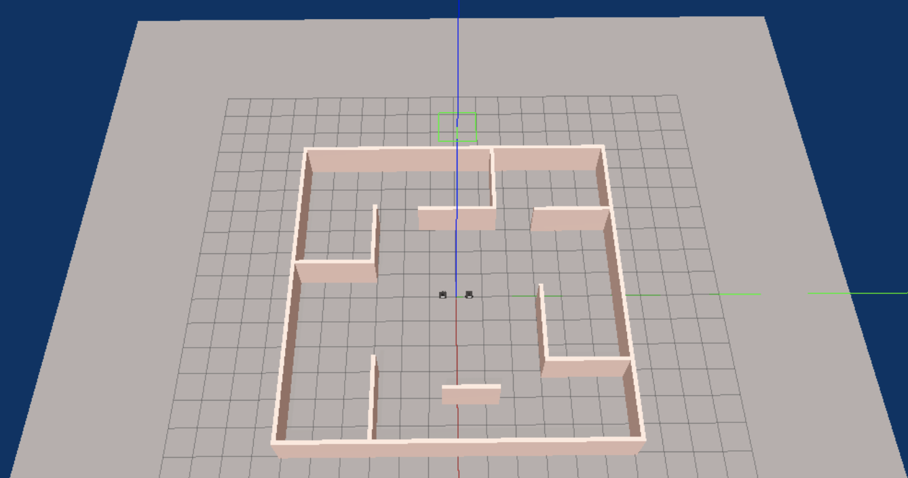

### Custom World

For our project, we decided to learn more about sdf and world files so that we could create a custom gazebo world that would best fit our goal. On gazebo, we made a model of a maze like room with rooms in four corners. We also added colors for the aesthetic of our program. We thought it would be helpful to make the world first and then start on our algorithm so that we could brainstorm effectivley. 

We had trouble in the beginnning figuring out how to run an sdf file but soon realized that we had to copy paste the code from the sdf file to a world file in order to add our model to a world. This was our final product: 

